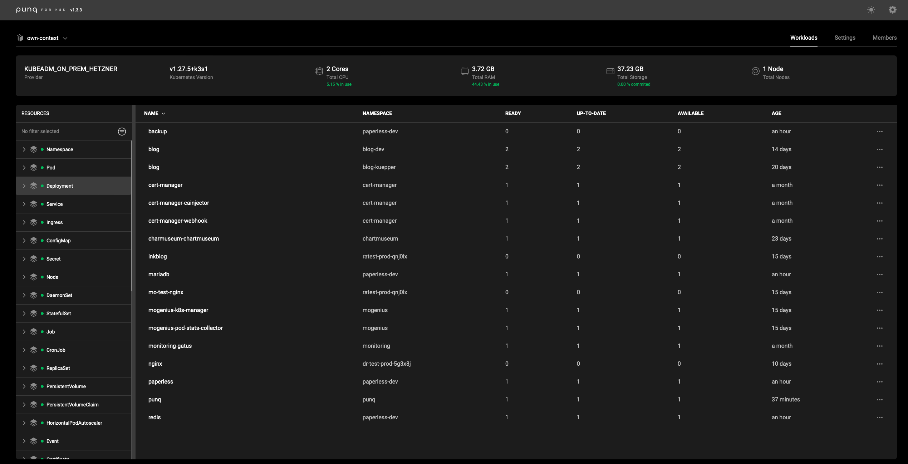

<p align="center">
  
</p>

<p align="center">
    <a href="https://github.com/mogenius/punq/blob/main/LICENSE">
        
    </a>
    <a href="https://github.com/mogenius/punq/releases/latest">
        
    </a>
    <a href="https://github.com/mogenius/punq/releases">
      
    </a>
    <a href="https://github.com/mogenius/punq">
      
    </a>
</p>
<p align="center">
    <a href="https://github.com/mogenius/punq">
      
    </a>
    <a href="https://github.com/mogenius/punq">
      
    </a>
</p>

# punq
Punq streamlines Kubernetes cluster management through an intuitive WebApp and a user-friendly CLI, designed to simplify the lives of DevOps professionals.

It offers unified team collaboration, comprehensive log access, and a sophisticated workload editor, facilitates seamless oversight and manipulation of clusters spanning various infrastructures.

This project is dedicated to enhancing operational efficiency within Kubernetes environments, with a particular focus on bolstering team-based workflows.

## How It Works

Punq offers a self-hosted solution, residing directly within your Kubernetes cluster, to create a dedicated instance for your team. Each instance is composed of:

- An operator, meticulously crafted in Golang, that maintains the core functionalities,
- A dynamic UI, brought to life with Angular, that ensures a smooth user experience.

Punq empowers you to seamlessly oversee multiple Kubernetes clusters. Simply import them from your local kubeconfig, and punq handles the rest, securely tucking away your configurations as secrets within your cluster.

Leveraging these configurations, punq presents a comprehensive view of all workloads and resources through its application. Consequently, every team member using your punq instance gains the capability to monitor and manage clusters, all without the necessity to access the kubeconfig directly. This not only enhances security but also promotes operational efficiency and team collaboration.



## Installation

Setting up punq is straightforward and conducted through the command line interface (CLI).

Currently, [Homebrew](https://brew.sh/) covers installation on macOS and Linux platforms whereas if you are a Windows user you can leverage [Scoop](https://scoop.sh/).

### macOS/Linux

```
brew tap mogenius/punq
brew install punq
```

### Windows

```
scoop bucket add mogenius https://github.com/mogenius/punq
scoop install punq
```

## Getting Started

After successfully installing punq, you're just a few steps away from harnessing its full potential. Here's how to get your journey started.

To install punq on your cluster within the current context and set up ingress routing, enabling you to access punq via your custom domain:

### Without Ingress (local / not exposed to the internet)

```
punq install
punq proxy
```

### With Ingress
```
punq install -i punq.yourdomain.com
```

And thereafter to finalize your punq setup, configure your domain, and getting started with using punq:

1. **Configure DNS Settings:**
	- Navigate to your domain's DNS management page,
	- Add a new DNS record for punq. This will typically be a CNAME record pointing `punq.yourdomain.com` to the address provided by your punq installation or the IP of your ingress controller. The exact setup may depend on your hosting or DNS provider,

2. **Access punq Interface:**
	- Open your preferred web browser and visit `punq.yourdomain.com` (replace with your actual subdomain).
	- If you've configured SSL (recommended for security reasons), ensure you're accessing punq over HTTPS (https://punq.yourdomain.com),

3. **Admin Login:**
	- Log in using the admin credentials provided during the punq installation. These credentials are displayed in your terminal post-installation. It's crucial to save these details securely, as they're shown only **once** and are necessary for administrative access,

4. **Explore Your Default Cluster:**
	- The cluster where punq is installed is automatically configured in your punq instance. Begin exploring the interface, reviewing workloads, and getting familiar with the environment,

5. **Add Additional Clusters:**
	- To manage more clusters, click on the dropdown menu in the top left corner of the punq interface,
	- Follow the on-screen instructions, which will include uploading your kubeconfig files for the additional clusters you want to manage,
	- Ensure each kubeconfig file is correct and up-to-date to avoid connection issues,

6. **Get Started:**
	- With your clusters added, you're ready to dive into using punq! 🤘 Start monitoring workloads, managing resources, and deploying applications across your clusters from one unified interface,

7. **Invite your team**
	- punq is great for working with Kubernetes in teams. Start by adding users with the CLI via `punq user add` together with the required flags.
 	- There are three roles that you can assign with the flag `-a` to set the access level of a user: ADMIN, USER, and READER.

8. **Stay Secure:**
	- Regularly update your login credentials and review your cluster's security settings to ensure your environment remains secure.

Remember, the punq community and documentation are valuable resources if you encounter any issues or have further questions as you embark on this streamlined Kubernetes management experience.

## Managing punq via CLI

Here are some basic punq commands to start with:

```
# List all available CLI features
punq help

# Install the punq operator in your current kubecontext
punq install -i punq.yourdomain.com

# Manage users and permissions
punq user

# Upgrade your punq instance to the recent version
punq upgrade

# Delete punq from your current kubecontext
punq clean
```

## Development

If you're interested in running the development version of punq, which corresponds to the `develop` branch of the repository, you can do so by following these instructions:

```
brew tap mogenius/punq-dev
brew install punq-dev
```

> However, please be aware that you **cannot** run both the standard (punq) and development (punq-dev) versions on the same cluster at the same time.

To update the documentation please run (in project root):

```
go install github.com/swaggo/swag/cmd/swag@latest
swag init --parseDependency --parseInternal
```

## FAQ
How to set a default editor for Windows (for example Visual Studio Code):
```
Open powershell as admin and run:
[System.Environment]::SetEnvironmentVariable("EDITOR", "code -w", [System.EnvironmentVariableTarget]::Machine)
```

## Community
The punq community is on Slack! Check out the workspace to discuss questions and ideas with fellow punq users and the team.  
[🏠 **Join us on Slack**](https://join.slack.com/t/punqworkspace/shared_invite/zt-25d91bf4j-rh7sfzx9zkTyr_dyj9kSjQ)

## Contribution

Punq is in its nascent stages, brimming with potential, and we're excited to extend an invitation for you to be part of this journey. Your insights, expertise, and contributions can significantly shape its evolution, enhancing this tool for many users and diverse needs. Here's how you can get involved:

1. **Explore Open Issues:**
	- Visit our repository and delve into the "Issues" section. These are the gateways to the current developmental challenges and enhancements that punq is looking to address,
	- Issues can range from simple documentation fixes, feature enhancements, to complex system builds, allowing you to contribute in areas that match your skills and interest,
	
2. **Choose an Issue:**
	- Pick an issue that resonates with your expertise or piques your interest. We recommend starting with "good first issues" if you're new to the project; they're designed to help you get familiar with the codebase and contribution process,

3. **Communicate:**
	- Before you start working, communicate your interest on the issue's thread. This step ensures transparency and prevents multiple contributors from working on the same issue unknowingly,
	- Feel free to ask for clarification or guidance if needed; our community and maintainers are here to support you,

4. **Fork and Branch:**
	- Fork the repository and create a new branch in your forked repository to work on the issue. It's a good practice to name your branch something descriptive that reflects the issue you're addressing,

5. **Code:**
	- Dive into the code and work your magic! Ensure your contributions adhere to the project's coding standards and guidelines, which are typically available in the repository,

6. **Test:**
	- After coding, rigorously test your changes. Contributions with thorough testing are more reliable and easier to merge,

7. **Create a Pull Request (PR):**
	- Once you're confident in your contribution, push your branch to your fork and submit a pull request to the original repository. Provide a detailed description of the changes in your PR, and reference the issue number you're addressing,
	- Await feedback or approval from the project maintainers. They may request some changes, improvements, or provide other feedback,

8. **Engage and Iterate:**
	- Respond to comments on your pull request and make requested changes until your PR is ready to be merged. This process can be a rewarding cycle of review and revision, enriching both your contribution and your expertise,

9. **Celebrate: 🥳**
	- Once your PR is merged, celebrate your contribution! It's a significant achievement to contribute to open-source projects,

Remember, open-source is not just about code. It's about collaboration, learning, and shared stewardship. Whether you're a seasoned developer or a newbie, your contributions are valuable and appreciated. So, let's shape the future of punq together!


Made with 💜 by the folks at [mogenius](https://mogenius.com)
